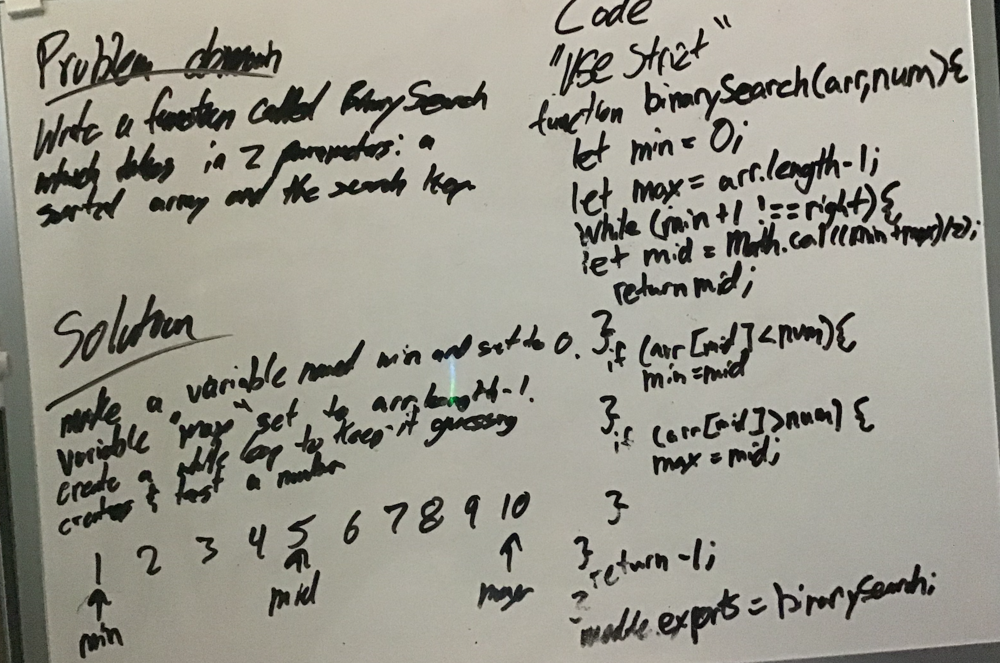

# Challenge Summary

Code Challenge 03

## Challenge Description

Write a function called BinarySearch which takes in 2 parameters: a sorted array and the search key. Without utilizing any of the built-in methods available to your language, return the index of the array’s element that is equal to the search key, or -1 if the element does not exist.

## Approach & Efficiency

Step one is to evaluate the problem and think critically. Then take out your white board and get to brain storming. Once you feel comfortable write out the code and check to see if it works.

## Solution

[link to code](array-binary-search.js)

- [x] Top-level README “Table of Contents” is updated
- [x] Feature tasks for this challenge are completed
- [x] Unit tests written and passing
  - [x] “Happy Path” - Expected outcome
  - [x] Expected failure
  - [] Edge Case (if applicable/obvious)
- [x] README for this challenge is complete
  - [x] Summary, Description, Approach & Efficiency, Solution
  - [x] Link to code
  - [x] Picture of whiteboard
