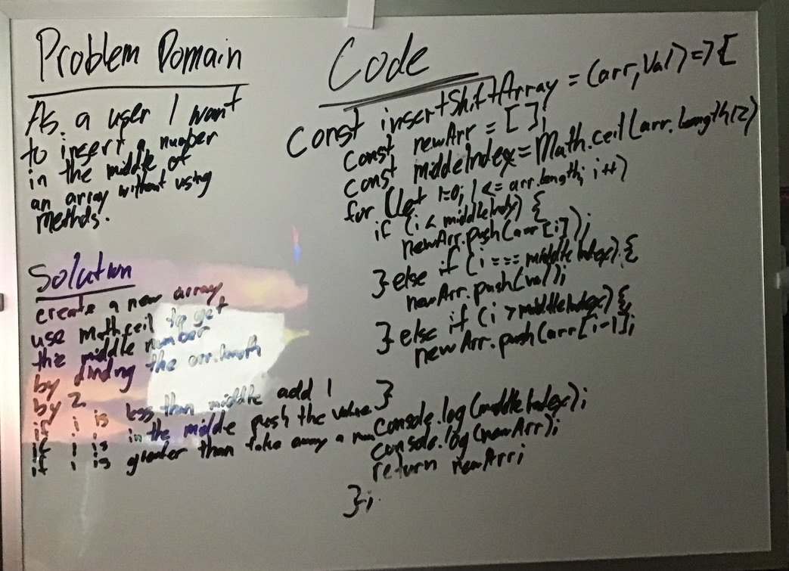

# Challenge Summary

Write a function called insertShiftArray which takes in an array and the value to be added. Without utilizing any of the built-in methods available to your language, return an array with the new value added at the middle index.

## Challenge Description

create a function that does the same thing as shift but without using shift.

## Approach & Efficiency

at first I used split to get it to work. However this wasnt allowed. So instead a for loop was used that checked if it was at the center of the problem and if it was to push the number in.

## Solution

