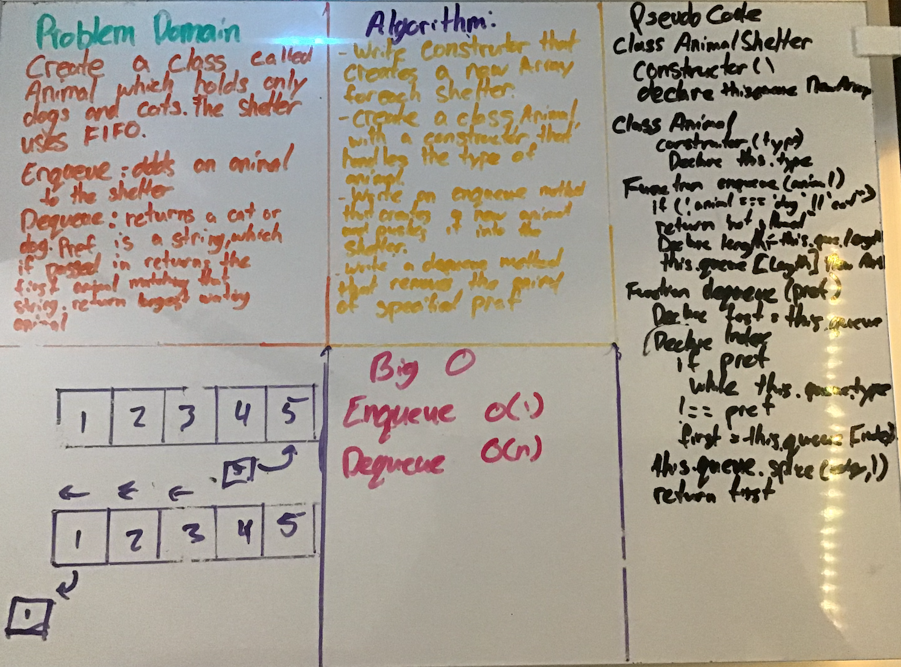

#  Animal Shelter

# Challenge Summary

Create a class called AnimalShelter which holds only dogs and cats. The shelter operates using a first-in, first-out approach.

## Challenge Description

Implement the following methods:
enqueue(animal): adds animal to the shelter. animal can be either a dog or a cat object.
dequeue(pref): returns either a dog or a cat. If pref is not "dog" or "cat" then return null.

## Approach & Efficiency

make a constructor that createss a new array for each shelter

create a class "animal" with a constructor that handles the types of animals

write and enque method that creaters a new animal and pushes it into the shelter

write a dequeue method that removes the first animal of specified pref

## Solution

