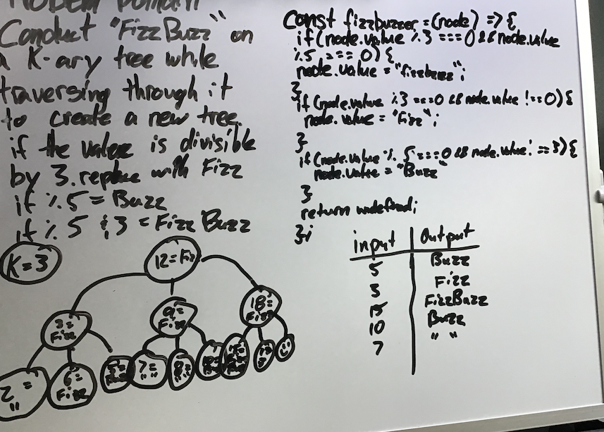

# Challenge Summar

* Write a function called FizzBuzzTree which takes a k-ary tree as an argument.

* Without utilizing any of the built-in methods available to your language, determine whether or not the value of each node is divisible by 3, 5 or both. Create a new tree with the same structure as the original, but the values modified as follows:

* If the value is divisible by 3, replace the value with “Fizz”
* If the value is divisible by 5, replace the value with “Buzz”
* If the value is divisible by 3 and 5, replace the value with “FizzBuzz”
* If the value is not divisible by 3 or 5, simply turn the number into a String.

## Whiteboard Process



## Approach & Efficiency

BIG O

Time = O(n*2h)
space = O(n*2)

## Solution

```
'use strict';

const fizzbuzzer = (node) => {
  if (node.value % 3 === 0 && node.value % 5 === 0) {
    node.value = 'fizzbuzz';
  }
  if (node.value % 3 === 0 && node.value % 5 !== 0) {
    node.value = 'fizz';
  }
  if (node.value % 5 === 0 && node.value % 3 !== 0) {
    node.value = 'buzz';
  }
  return undefined;
};

const postTraversal = (root) => {
  if (!root) {
    return undefined;
  }
  postTraversal(root.left);
  postTraversal(root.right);
  fizzbuzzer(root);
  return undefined;
};

module.exports = function fizzbuzztree(tree) {
  postTraversal(tree.root);
  return tree;
};
```

## Tests

```const treeOne = new Tree(1);
treeOne.root.left = new Node(4);
treeOne.root.right = new Node(3);
treeOne.root.right.left = new Node(15);
treeOne.root.left.right = new Node(14);
treeOne.root.left.right.left = new Node(10);

describe('fizzbuzztree tests', () => {
  test('return node that has a value of 3, change it to fizz', () => {
    fizzbuzztree(treeOne);
    expect(treeOne.root.right.value).toEqual('fizz');
  });

  test('return node that has a value of 5, change it to buzz', () => {
    fizzbuzztree(treeOne);
    expect(treeOne.root.left.right.left.value).toEqual('buzz');
  });

  test('return a tree node that had a value of 15, change it to fizzbuzz', () => {
    fizzbuzztree(treeOne);
    expect(treeOne.root.right.left.value).toEqual('fizzbuzz');
  });
});
```