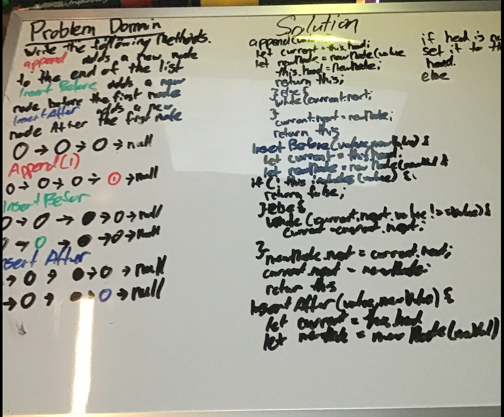

# Singly Linked List
Create a linked list algo

## Challenge

write a link lists that passes theses tests

Can successfully instantiate an empty linked list

Can properly insert into the linked list

The head property will properly point to the first node in the linked list

Can properly insert multiple nodes into the linked list

Will return true when finding a value within the linked list that exists

Will return false when searching for a value in the linked list that does not exist

Can properly return a collection of all the values that exist in the linked list

## Approach & Efficiency

- [x] Top-level README “Table of Contents” is updated
- [x] Feature tasks for this challenge are completed
- [x] Unit tests written and passing
  - [x] “Happy Path” - Expected outcome
  - [x] Expected failure
  - [] Edge Case (if applicable/obvious)
- [x] README for this challenge is complete
  - [x] Summary, Description, Approach & Efficiency, Solution
  - [x] Link to code
  - [x] Picture of whiteboard

