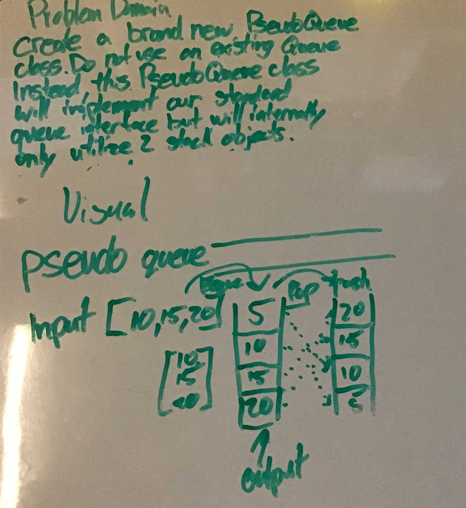

#  Implement a PseudoQueue with 2 stacks

# Challenge Summary

Create a class for a PseudoQueue that uses 2 stacks and their methods to define the enqueue and dequeue methods of the new class

## Approach & Efficiency

* Created new class with a constractor that initiates two new stacks

* Used stack methods like pop and push between the two stacks

* Before enqueue or dequeue all items have to be shifted from stack to another to access the right nodes

## Solution

- [x] Top-level README “Table of Contents” is updated
- [x] Feature tasks for this challenge are completed
- [x] Unit tests written and passing
  - [x] “Happy Path” - Expected outcome
  - [x] Expected failure
  - [x] Edge Case (if applicable/obvious)
- [x] README for this challenge is complete
  - [x] Summary, Description, Approach & Efficiency, Solution
  - [x] Link to code
  - [x] Picture of whiteboard
