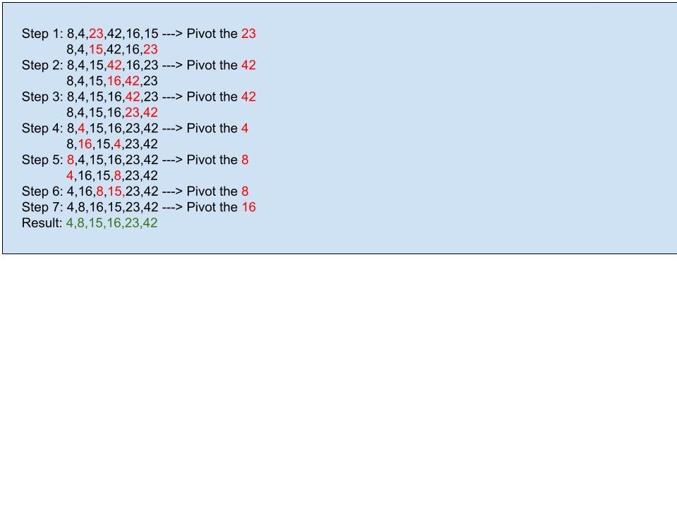

# Quick Sorts

## Summary

The basic idea of Quick Sort is a sorting technique based on divide and conquer technique. It has a worst-case time complexity being Ο(n log n). It first divides the array into equal halves and then combines them in a sorted manner.

## Challenge Description

Complete a working, tested implementation of quick Sort, based on the pseudo code Provided

## Aooroach and Efficiency

Researed the topic of quick sorting and watched some videos to help me understand the subject. Then wrote a test to help me create the code.

## Provided Pseudo code

```

ALGORITHM QuickSort(arr, left, right)
    if left < right
        // Partition the array by setting the position of the pivot value
        DEFINE position <-- Partition(arr, left, right)
        // Sort the left
        QuickSort(arr, left, position - 1)
        // Sort the right
        QuickSort(arr, position + 1, right)

ALGORITHM Partition(arr, left, right)
    // set a pivot value as a point of reference
    DEFINE pivot <-- arr[right]
    // create a variable to track the largest index of numbers lower than the defined pivot
    DEFINE low <-- left - 1
    for i <- left to right do
        if arr[i] <= pivot
            low++
            Swap(arr, i, low)

     // place the value of the pivot location in the middle.
     // all numbers smaller than the pivot are on the left, larger on the right.
     Swap(arr, right, low + 1)
    // return the pivot index point
     return low + 1

ALGORITHM Swap(arr, i, low)
    DEFINE temp;
    temp <-- arr[i]
    arr[i] <-- arr[low]
    arr[low] <-- temp

```

## Algorithm

Partition the array by selecting the pivot value (23), and move the pivot to the end of the array.
Move the left bound to the right until it reaches a value equal to or greater than the pivot
Move the right bound to the left until it crosses the left bound or finds a value less than the pivot. (42)
This pattern continuous until the right side of the list sorted, then continuous to sort the sub-list or left side.

## Art


