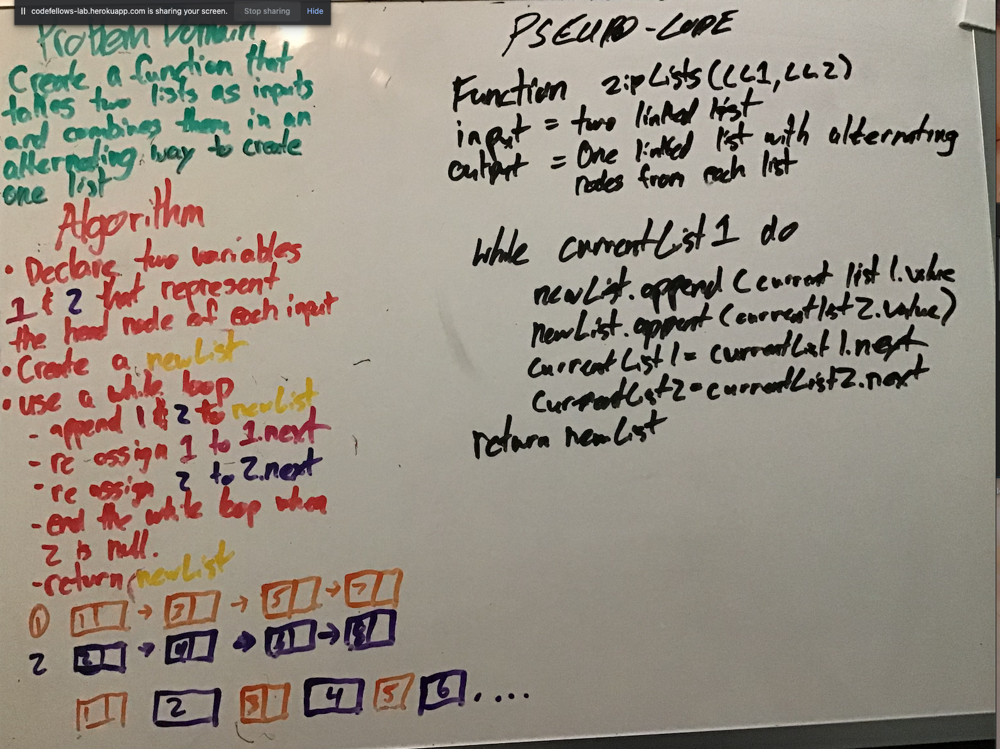

# Challenge Summary

Create a linked list that merges the lists 1 by 1 into a single linked list

## Challenge Description

Create a function to do wht the summary says

## Approach & Efficiency

Create an algo to go back and forth between two input lists to make a single list

## Solution

 - [x] Top-level README “Table of Contents” is updated
 - [x] Feature tasks for this challenge are completed
 - [x] Unit tests written and passing
     - [x] “Happy Path” - Expected outcome
     - [x] Expected failure
     - [x] Edge Case (if applicable/obvious)
 - [x] README for this challenge is complete
     - [x] Summary, Description, Approach & Efficiency, Solution
     - [x] Link to code
     - [x] Picture of whiteboard